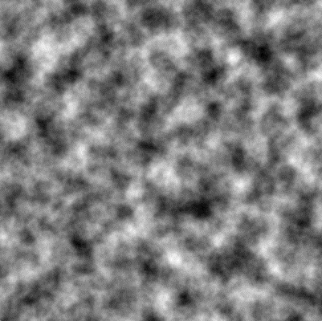
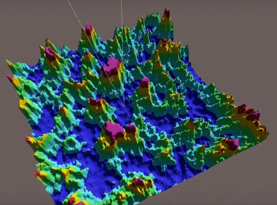
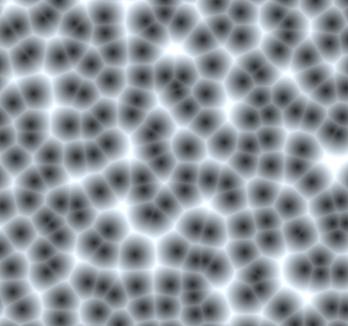
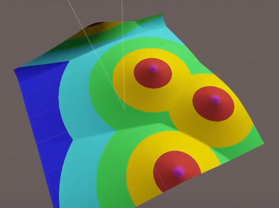
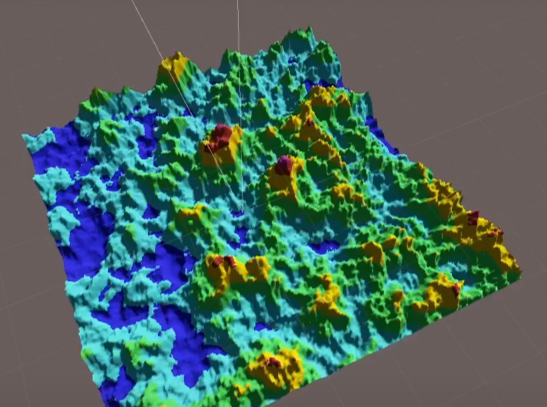

# IDLE_Plane
Procedural terrain generation project    

## requirement
> * Unity v2020.3.19 https://unity3d.com/kr/unity/whats-new/2020.3.19

## Results
https://www.youtube.com/watch?v=rrfsa5liCdQ    
    
        
      

## Terrain generation
Generate endless terrain based on 'Perlin-noise' and 'Voronoi noise'

### Perlin noise
       

### Vornoi noise
   

### Blend
  
